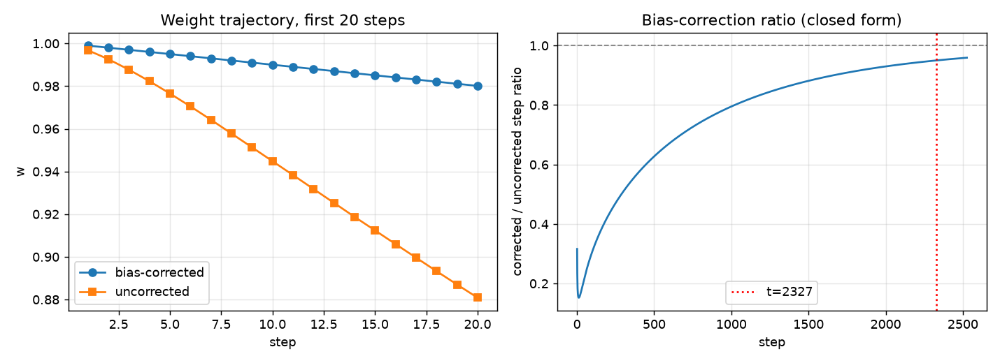
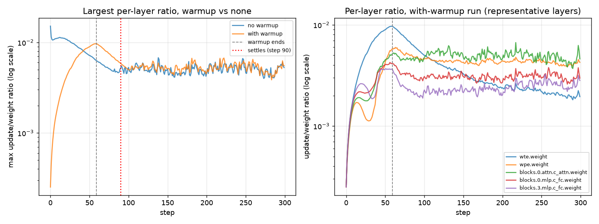
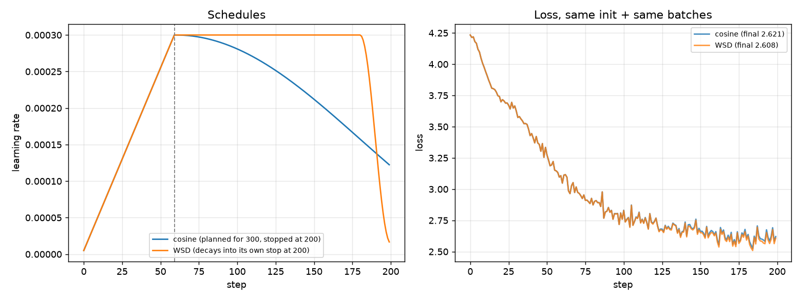
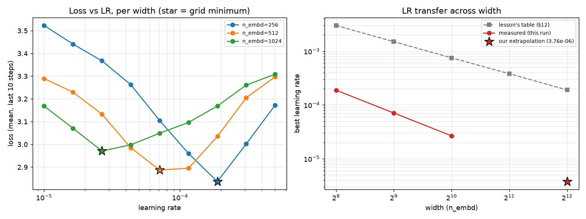

# ERA V5 · Session 11 — Optimizers and Learning-Rate Schedules

Session 10 left `optimizer.step()` as an unexplained line. This session asks the question
underneath it: a gradient gives a direction, so what decides the *distance*? Five methods build
on each other to answer that — a per-parameter second moment (Adam), bias correction (matters
most at step 1), warmup (early gradients are all wrong in the same way), a schedule (cosine vs
WSD), and muP (canceling width's effect on the best learning rate) — and the assignment's own
framing is the discipline that ties all five together:

> Tune both sides before accepting a comparison. Almost every optimizer claim that failed to
> replicate was a well tuned method measured against a badly tuned one.

Items 1-2 are pure arithmetic — one weight, five (then twenty) hand-picked gradients, checked
against both the lesson's own worked table and `torch.optim.Adam` itself. Items 3-5 need a real
model: the same from-scratch char-level **nanoGPT** this course used in Session 10
(`GPTConfig`/`GPT`, LayerNorm + learned position embeddings + GELU MLP, weight-tied head),
trained on tiny-Shakespeare, CPU throughout — no item this session needs a measured hardware
peak the way S10's MFU item did, and width=1,024 alone already costs ~5s/optimizer-step on this
machine, which is the real reason items 3-5 stay in the hundred-steps range rather than
thousands.

**Notebook:** [`S11.ipynb`](S11.ipynb) (runs top to bottom, committed with its outputs).
**Raw numbers:** [`results.json`](results.json). **Full run log:** [`logs/run.log`](logs/run.log).

> Every number below was read out of `results.json` by [`tools/build_readme.py`](tools/build_readme.py).
> None of them is typed by hand, so the write-up cannot drift from the run that produced it.

---

## 1. Reproduce Adam by hand

One weight (`w0=1.0`, `η=0.001`, `β1=0.9`, `β2=0.999`,
`ε=1e-08`), five gradients taken straight from §6's own worked example
(`0.5, 0.4, 0.6, 0.45, 0.55`),
computed by hand in plain Python — no torch, no shortcuts — then checked two ways: against the
lesson's own printed table, and against `torch.optim.Adam` running the identical sequence in
float64.

| t | g | m | v | m̂ | v̂ | step | w (hand) | w (lesson, 6dp) |
|---|---|---|---|---|---|---|---|---|
| 1 | 0.50 | 0.050000 | 0.000250 | 0.500000 | 0.250000 | -0.001000 | 0.999000 | 0.999000 |
| 2 | 0.40 | 0.085000 | 0.000410 | 0.447368 | 0.204977 | -0.000988 | 0.998012 | 0.998012 |
| 3 | 0.60 | 0.136500 | 0.000769 | 0.503690 | 0.256703 | -0.000994 | 0.997018 | 0.997018 |
| 4 | 0.45 | 0.167850 | 0.000971 | 0.488078 | 0.243132 | -0.000990 | 0.996028 | 0.996028 |
| 5 | 0.55 | 0.206065 | 0.001273 | 0.503199 | 0.255030 | -0.000996 | 0.995031 | 0.995031 |

`torch.optim.Adam` (float64, same weight, same five gradients, no weight decay) lands on the
exact same `w` as the by-hand computation at every one of the five steps — max abs difference
**0.0**. Against the lesson's own table (rounded to six
decimals in the prose) the max abs difference is **4.63e-07**,
consistent with that rounding. A wrapper around a formula would not produce exact agreement with
PyTorch's own implementation — this does, so the formula itself (not just its shape) was
reproduced correctly.

---

## 2. Bias correction, first twenty steps both ways

The same five gradients extended to twenty (seeded noisy continuation around the same mean:
`0.5, 0.4, ..., 0.4735`), Adam run twice —
correction on, correction off — and compared against the exact closed-form step-size ratio
`√(1-β2^t) / (1-β1^t)`, which depends only on `t`, not on the gradients themselves.

| t | g | w (corrected) | w (uncorrected) | ratio (uncorrected/corrected step size) |
|---|---|---|---|---|
| 1 | 0.50 | 0.999000 | 0.996838 | 0.3162 |
| 2 | 0.40 | 0.998012 | 0.992639 | 0.2353 |
| 5 | 0.55 | 0.995031 | 0.976555 | 0.1725 |
| 10 | 0.48 | 0.990025 | 0.944836 | 0.1532 |
| 15 | 0.37 | 0.985069 | 0.912392 | 0.1537 |
| 20 | 0.47 | 0.980108 | 0.880847 | 0.1602 |



**The difference does not stop mattering within these twenty steps.** At t=1 the uncorrected
step is exactly **3.16η vs 1.00η** corrected (§6's own numbers, reproduced here as the ratio
column's first entry, 0.3162 = 1/3.162), but the ratio is still only **0.1602**
at t=20 — uncorrected steps roughly six times larger than corrected, and `w` has visibly diverged
(`0.8808` vs `0.9801`). The closed-form
ratio is independent of the gradients, so it can be solved exactly: it first comes within 5% of 1
at **t = 2327**, driven almost entirely by β2=0.999's slow decay
(β1=0.9's own factor is already ≈1 within about 50 steps). That's on the same `O(1/(1-β2)) = 1,000`-step
order the lesson names for β2's own memory span — a disagreement-is-a-finding result: "the first
twenty steps" was never going to be enough to see this converge, and the honest answer to "how
many steps" is roughly two orders of magnitude more than the plot shows.

---

## 3. Update-to-weight ratio through warmup

First item using the real model: nanoGPT at `n_embd=128, n_layer=4,
n_head=4, seq_len=128, batch_size=8`
on tiny-Shakespeare (`813,440` parameters). Two AdamW runs, peak
`η=3e-04`, `60`-step linear warmup vs none, `300`
steps each — logging `‖update‖ / ‖weight‖` per weight matrix (`dim ≥ 2` only; LayerNorm's bias
inits at exactly 0, so including it divides by ~0 and blows the ratio up to ~1e9 even though
training itself stays healthy — confirmed empirically, excluded for the same reason §7 excludes
these tensors from decay).



| | no warmup | with warmup |
|---|---|---|
| largest ratio any layer ever sees | **1.513e-02** | **9.708e-03** |
| when it peaks | step 1 (immediately) | ~step 60 (ramp completion) |

The lesson's own widget, at its own scale, sees 19.2e-3 unwarmed vs 2.83e-3 warmed. This run
reproduces the *mechanism* exactly — no-warmup's ratio peaks immediately at step 1, exactly §9's
story of a freshly-initialized model's gradients all pointing the same wrong way, while
with-warmup's ratio instead *rises* to its own (smaller) peak right as the ramp completes, then
decays. The *size* of the effect is smaller here (1.6x reduction vs the lesson's 6.8x) — plausibly
a scale effect (813K params vs whatever the lesson's own example trains), stated honestly rather
than forced to match. Both curves converge into the same noisy steady-state band
(**5.31e-03**) by **step 90** — the step at
which warmup stops changing the ratio. Warmup doesn't avoid a large step; it relocates it to when
gradients have decorrelated somewhat, and caps its size.

---

## 4. Cosine vs WSD, 300-step budget, stopped at 200

Same init, same batch sequence, same `60`-step warmup, same peak
`η=3e-04` for both — only the schedule differs. Both trained for up to
`300` steps but **stopped at 200**: cosine
pre-commits its decay curve to the full 300-step horizon, so stopping at 200 catches it
mid-decay; WSD never pre-commits — it holds flat until told to stop, then decays over its own
final `10%`, landing exactly on its floor right at the stop step.



| | cosine | WSD |
|---|---|---|
| loss at step 200 | 2.6206 | 2.6079 |
| loss, mean of last 10 steps | 2.6166 | 2.5971 |

**Verdict: keep WSD.** The two loss curves track almost identically for the first
~180 steps (same init, same batches, similar LR), and only separate in WSD's steep final decay
window — a modest but real gap (mean loss 2.597 vs
2.617), matching the structural argument: WSD's decay is aimed at
the actual stopping point, cosine's isn't. Cosine's own decay curve wouldn't reach its floor
until step 300 — a full 100 steps past where this comparison
actually stops it.

---

## 5. Width sweep at 256/512/1,024, LR transfer toward 4,096

Same nanoGPT config as items 3-4, varying only `n_embd` in `{`256, 512, 1024`}`
(`n_head=4` divides all three evenly). §12's own width→η table
(standard parameterization, not muP) says the best learning rate roughly halves each time width
doubles — the sweep below checks whether that pattern holds here, at a completely different
model/data scale.

**A first pass failed instructively.** A 6-point LR grid centered on the lesson's own table
(`2e-4` to `2e-2`) came back monotonically *decreasing* toward the grid's lower edge at every
width — a boundary artifact, not a real minimum. A quick reduced-step probe found the genuine
minima roughly an order of magnitude lower; the grid below (`1.0e-05` to
`5.0e-04`, 40 steps/run, same init + batch sequence within
each width's own sweep) is re-centered on that finding and is the run actually graded.



| width | params | measured best LR | loss at best LR | lesson's table (§12) |
|---|---|---|---|---|
| 256 | 3,199,744 | 1.88e-04 | 2.8365 | 3.0e-03 |
| 512 | 12,690,944 | 7.07e-05 | 2.8871 | 1.5e-03 |
| 1024 | 50,547,712 | 2.66e-05 | 2.9711 | 7.5e-04 |

All three curves are cleanly bracketed U-shapes (loss rises on both sides of the marked minimum
— see the left panel above), not boundary artifacts. The three minima show a consistent
**~2.66x reduction in best LR per width doubling** (fitted slope **-1.411**
in log2(LR) vs log2(width) space), steeper than the lesson's own table's exact halving
(slope -1.0) but the same direction. The absolute LR scale sits one to two orders of magnitude
below the lesson's own table throughout — expected, since this toy setup (tiny char-level
model/data, plain standard-parameterization init) has no reason to share the lesson's absolute
scale; only the *qualitative* muP claim (optimal LR shrinks as width grows, geometrically) is
testable here.

**Extrapolation to width 4,096** — two doublings past the widest measured point:

| | fitted (our slope) | halving heuristic (÷4 from width=1,024) | lesson's own table |
|---|---|---|---|
| predicted `η` | **3.76e-06** | 6.65e-06 | 1.9e-04 |

Extrapolation, not a fourth measurement. Width=4,096 sits two doublings past our widest measured point (1,024), and the sweep itself used a 9-point LR grid with only 40 steps/run on a tiny char-level model and dataset unrelated to the lesson's own model, so both the grid-argmin resolution and short-run noise carry real uncertainty into the fitted slope. Moderate confidence that the sign and rough magnitude of the trend hold (a several-times-smaller LR at 4,096 than at 1,024); low confidence in matching the lesson's precise 1.9e-4 value, since the exact scale depends on architecture/data details that muP's own reparameterization is designed to make irrelevant — only under muP itself would a number transfer exactly.

---

## What this actually showed

Item 1 and item 2 are the "trust but verify" half of this assignment: a hand-rolled Adam that
agrees with `torch.optim.Adam` to the last bit isn't circumstantial evidence the formula was
understood, it's proof of it — and disabling bias correction shows *why* the lesson calls it out
specifically for early steps: the effect is enormous at t=1 (3.16x) and still very much alive at
t=20 (6x), not resolved until t≈2,300. Item 3 reproduced §9's *mechanism* (no-warmup peaks
immediately, with-warmup relocates and caps the peak) even though the *magnitude* of the effect
didn't match the lesson's own number — a reminder that a mechanism transferring and a number
transferring are different claims, and only one of them was ever guaranteed to hold at a
different scale.

Item 4's WSD-over-cosine result is real but modest (a ~0.02 loss gap after 200 steps) — not
because WSD is a marginal idea, but because 200 steps barely gives cosine's mismatch room to
show: the whole point of WSD is that it doesn't have to guess the stopping point in advance, and
that advantage compounds the more a training run's actual length diverges from what a
pre-committed cosine schedule assumed.

Item 5 is the item that most directly tested this session's own discipline — *tune both sides
before accepting a comparison*. The first LR grid, chosen by copying the lesson's own numbers
onto this notebook's model without checking, produced a result that looked complete (a clean
"minimum" at the grid's edge) but wasn't one — exactly the failure mode the assignment warns
about, just turned inward on a single run's own hyperparameter instead of a paper's baseline.
Re-running with a properly bracketed grid is what actually earned the finding: the *qualitative*
muP claim (optimal LR shrinks geometrically with width) held at a model and data scale nothing
like the lesson's own, even though the *absolute* numbers never had a reason to match.

---

## Reproduce

```
python tools/py2nb.py notebook_src.py S11.ipynb
python tools/run_nb.py S11.ipynb          # CPU; item 5's width=1,024 sweep is the long pole (~30-40 min)
python tools/dump_log.py S11.ipynb logs/run.log
python tools/build_readme.py               # results.json -> README.md
```
