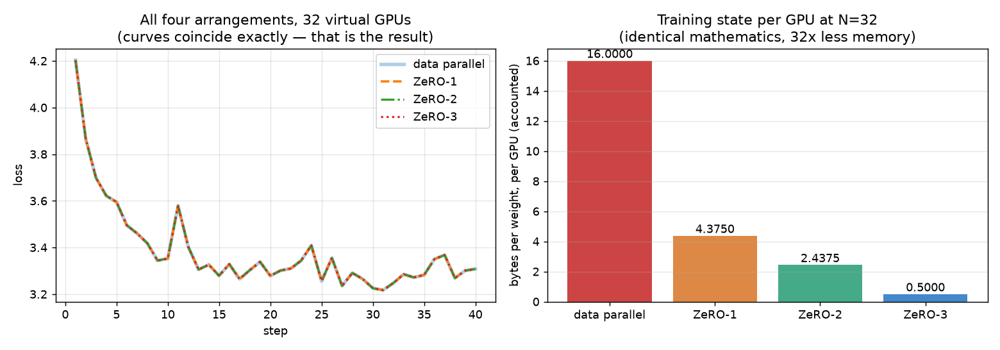
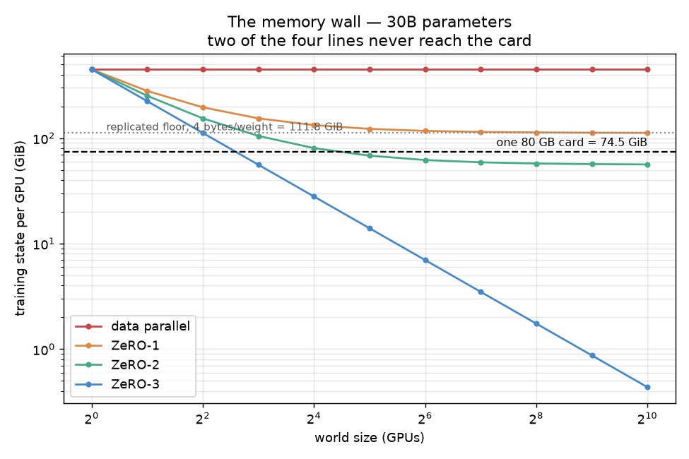

# Session 12 — Distributed Training I: Data Parallel and ZeRO

**32 virtual GPUs, a real model running on top of them, and ZeRO-1/2/3 implemented over
that.** ERA V5 (The School of AI), Session 12.

Everything below came out of [`S12.ipynb`](S12.ipynb), which runs top to bottom on CPU in
about 167 seconds. Every number in this README is substituted
from [`results.json`](results.json) by [`tools/build_readme.py`](tools/build_readme.py) —
none of them is typed by hand, and the build fails if any placeholder cannot be resolved.

---

## The problem with writing a simulator

The previous three sessions measured a real model training and reported what happened. This
one asks for a simulator, and that changes what counts as evidence. **A simulator can produce
any number I want it to.** "My ZeRO-3 used 32x less memory" is worth nothing on its own —
I wrote the thing that computed it.

So the notebook is built around one discipline: every quantity it computes is checked against
a number the lesson published independently, and each check is an `assert` that fails the
build if it breaks. The lesson gives four such anchors, and they pin down different things:

| anchor | lesson | what it constrains |
| --- | --- | --- |
| 16 bytes per weight | §1 | the memory model itself |
| 16.00 / 5.50 / 3.75 / 2.00 bytes per weight **at 8 GPUs** | §6 | the sharding arithmetic |
| 447.0 / 122.2 / 68.1 / 14.0 GiB at 32 GPUs, 30B params | §7 | the same arithmetic at other world sizes |
| 2P / 2P / 2P / 3P | §6 | communication volume, a separate quantity |

The second one is the one I care about most. **The notebook never runs at 8 GPUs** — it runs
at 32, because that is what the assignment asks for. So agreement with §6's table is not
something I could have fitted the simulator into; the mechanism either reproduces it or it
does not. §12 pushes that further: the same function reproduces all sixteen numbers of the
§7 ladder, twelve of them at world sizes nothing was ever simulated at, to within
0.04 GiB.

## Results

Measured at the assignment's world size of **32 virtual GPUs**, on
nanoGPT (813,440 parameters), over 40 steps of
4,096 tokens each:

| arrangement | bytes/weight | vs DP | communication | 30B @ 32 GPUs | fits a 74.5 GiB card? |
| --- | --- | --- | --- | --- | --- |
| data parallel | 16.0000 | 1.0x | 1.9375P | 447.0 GiB | no, at any world size |
| ZeRO-1 | 4.3750 | 3.7x | 1.9375P | 122.2 GiB | no, at any world size |
| ZeRO-2 | 2.4375 | 6.6x | 1.9375P | 68.1 GiB | yes, from 32 GPUs |
| ZeRO-3 | 0.5000 | 32.0x | 2.9062P | 14.0 GiB | yes, from 8 GPUs |

And the result that matters more than any of those:

> **All four arrangements are bit-identical.** Same losses, same weights, every parameter,
> over all 40 steps. Largest weight difference against data parallelism:
> **0.0**.

ZeRO moved 96.9% of the training state off each GPU and
changed nothing whatsoever about what the model learned. That is the actual claim ZeRO makes,
and it is the one worth verifying.



---

## 1. Why a weight costs 16 bytes

The whole session follows from one piece of arithmetic, so it is worth being able to
reconstruct it rather than quote it:

| stored for one weight | bytes | why |
| --- | --- | --- |
| the weight, bf16 | 2 | what the matmuls actually consume |
| its gradient, bf16 | 2 | produced by the backward pass |
| fp32 master copy | 4 | see below |
| Adam's `m` and `v`, fp32 each | 8 | Session 11's two running averages |
| **total** | **16** | |

At V5's 30 billion parameters that is **447.0 GiB** — about
6 cards of 74.5 GiB each, before a single
activation exists. That is the entire motivation for the session.

The entry I wanted to verify rather than accept is the **fp32 master copy**. The lesson's
justification is that "repeatedly adding very small updates to a 16-bit number loses them to
rounding," which is a testable claim, so the notebook tests it: adding `1e-4` to `1.0` a
thousand times, in bf16 and in fp32.

bf16 keeps 8 mantissa bits, so its resolution near 1.0 is 2⁻⁸ ≈ 0.0039 — about 39x larger
than the update. Every single addition rounds straight back to 1.0. The bf16 accumulator
finishes at exactly 1.0 while fp32 reaches 1.1, so
**100% of the training signal is lost** without the
master copy. Those 4 bytes are not redundancy; they are the reason training converges at all.

This also explains something that comes up again in §15: **the optimizer, not the model, is
most of training memory.** 12 of the 16 bytes are fp32 state that exists for numerical
reasons, and no amount of low-precision arithmetic touches them.

## 2. The fabric — what "32 virtual GPUs" actually means

A virtual GPU here is a rank number and a memory ledger. It holds no data of its own, because
in a single process the data lives in ordinary Python lists indexed by rank; pretending
otherwise would add ceremony without adding fidelity.

The fabric does two things carefully.

**It computes the real result of each collective.** `all_reduce`, `reduce_scatter`,
`all_gather` and `broadcast` return the tensors that would come out on real hardware.

**It counts bytes under the ring cost model** — which is where a simulator earns its keep,
because this is the "how the computation changes" half of the assignment and it is easy to
get subtly wrong.

### Where I disagree with the lesson's 2P, slightly

The lesson says a ring all-reduce sends "about one copy" of the data in each of its two
phases, giving 2P. That "about" is doing real work. In a ring of `N` GPUs a reduce-scatter is
`N-1` sends of a `1/N` chunk, so each GPU sends `(N-1)/N` of a full copy — not a full copy:

```
reduce-scatter : (N-1)/N · P
all-gather     : (N-1)/N · P
all-reduce     : 2(N-1)/N · P
```

At N=32 that is **1.9375P**, not 2P. The lesson's 2P is
the large-N limit, and it is the right figure to quote for a 30B model where a 3% gap is
noise against every other approximation in the estimate. But a simulator that counts actual
sends should report what it counted, so the notebook reports the exact number and shows it
converging on 2P as N grows. **Where the simulation is more precise than the table it is
checked against, it says so rather than rounding itself into agreement.**

## 3. Are the collectives right?

Three checks, in increasing order of how badly a failure would matter.

**The identity everything rests on.** §4's claim is that a reduce-scatter followed by an
all-gather produces *exactly* what an all-reduce produces. This is not a detail — it is the
entire reason ZeRO-1 and ZeRO-2 are free. Measured difference:
**0.0**, i.e. bit-identical, not merely close.

**The cost model.** The byte counters land on `2(N-1)/N·P`, and the all-reduce total equals
the sum of its two halves — the cost-side statement of the same identity.

**A real backend.** The two checks above compare the simulator with itself, which proves
nothing about whether my idea of a collective matches anyone else's. So the notebook spawns
**4 real `torch.distributed` processes on the gloo backend** and
compares their output tensor by tensor. Largest disagreement:
**1.2e-07** — float32 rounding, not a difference in
meaning. (Not bit-identical, and it should not be: gloo reduces in ring order, the fabric via
`torch.stack().mean(0)`. Different summation orders, same mathematics.)

## 4. The model and the shard map

nanoGPT from Sessions 10/11, copied unchanged: `n_embd=128, n_layer=4, n_head=4,
seq_len=128`, **813,440 parameters** in 36 tensors
(`wte`/`lm_head` tied, counted once). Reusing it keeps continuity, and more usefully gives a
realistic *per-layer* parameter distribution — an embedding table, four blocks of quite
different internal shapes, a final layer norm. A uniform toy model would make stage 3's
per-layer gather look tidier than it is.

ZeRO splits state into `N` equal pieces, and there are two ways to choose them: one flat
buffer for the whole model sliced into `N` (DeepSpeed's way), or each layer's buffer sliced
into `N` (closer to FSDP2, which shards each parameter along its first dimension). Both give
exactly `1/N` per rank, so the memory arithmetic is identical. **I shard per layer group**,
because stage 3's per-layer gather-use-discard cycle needs a rank's slice of a *layer* to be
well defined.

Each rank owns **25,420** parameters. Every group happens to divide
evenly by 32 here, so no padding is needed — the notebook asserts that rather than assuming
it. Real implementations pad the last shard.

## 5–8. The four arrangements

The runner is one function with three booleans, and those booleans are the entire difference
between the four arrangements:

```python
shard_opt    = stage in ("zero1", "zero2", "zero3")   # the 12 optimizer bytes
shard_grad   = stage in ("zero2", "zero3")            # the 2 gradient bytes
shard_weight = stage == "zero3"                       # the 2 weight bytes
```

Every other line is shared. That is not code-golf — it is the structural statement that ZeRO
changes *where state lives* and nothing else, and it is what makes §10's exact-equivalence
result possible rather than approximate.

**Data parallelism.** 32 ranks, a full copy each, a different micro-batch each, one
all-reduce to average the gradients. The check worth reproducing is §3's widget readout: the
largest difference between any two of the 32 weight copies, across all
40 steps, was **0.0**. They are
bit-identical, which is what makes averaging the gradients correct — and also what makes 31
of the 32 copies pure redundancy.

**ZeRO-1** shards the optimizer state. Communication is unchanged —
1.9375P against data parallelism's
1.9375P — because of §4's identity: data parallelism
was *already* doing a reduce-scatter and an all-gather, and stage 1 just keeps the
intermediate slice instead of discarding it.

**ZeRO-2** also discards each gradient once it has been sent to its owner, taking gradients
from 2 bytes per weight to `2/N`. Still 1.9375P.

**ZeRO-3** shards the weights too. Now a rank does not have the weights it needs to compute
with, so it gathers each layer, uses it, discards it — and the backward pass has to fetch
them a second time. Three charged phases per step instead of two, and notably **no fourth**:
stage 3 never gathers the updated weights at the end of a step, because the next forward pass
is going to gather them anyway. That is where
2.9062P comes from.

## 9–10. What the simulator found, and whether it can be believed

Measured against the closed form at N=32, every value agrees to floating-point exactness.
Measured against the lesson's §6 table at N=8 — a world size never run — all four agree
exactly. The full comparison is in the results table above.

**The equivalence check is the strict one.** The instructor's own instruction was to *"ask it
to make sure that it matches what ZeRO does,"* and the strictest reading of that is not about
byte counts at all: ZeRO is a claim about storage, so rearranging where the optimizer state
lives must not change a single number the model learns. If the four loss curves differ, the
implementation is wrong however well the memory table lines up.

The bar is set at **bit-identical** rather than a tolerance, deliberately — a tolerance could
hide a real difference. It is achievable because `reduce_scatter` computes the same reduction
as `all_reduce` and then slices it, so rank `r` receives bit-for-bit the values data
parallelism would have used for those elements, and Adam is elementwise.

## 11. The memory wall — the sharpest result here



The mechanism can be asked a question the simulator was never run for: at what world size
does each arrangement actually fit? The answer contains the one fact a four-number table
hides.

> **Data parallelism and ZeRO-1 never fit. Not at 64 GPUs, not at 1,024, not ever.**

Both leave weights *and* gradients replicated — 4 bytes per weight — and 4 bytes across 30
billion weights is **111.8 GiB** regardless of how many
cards there are. Adding GPUs divides the sharded part and does exactly nothing to the
replicated part, so those two lines approach a floor above the 74.5 GiB
rule and stay there. This is the part I found genuinely counter-intuitive before working it
out: buying more hardware does not fix a replication problem, at all, ever.

The same floor says where the boundary is: 4 bytes per weight fills a card at precisely
**20B parameters**. A 20B model is on the line; V5's 30B is
past it. That single number is why the session concludes the choice is ZeRO-2 or ZeRO-3 and
nothing below.

ZeRO-2 fits from 32 GPUs, ZeRO-3 from
8 — matching §7 exactly.

## 13. Bucketing and overlap

Communication that happens while the GPU is busy costs nothing. The backward pass runs
**last layer first**, so the last layer's gradients are done long before the pass reaches the
first layer and can start moving immediately.

The lesson gives one number to check: at a bucket of two layers on an H100 step, 83% of the
transfer finished before the backward pass ended. My model gives
**83.3%**, and the reason is pleasingly simple once
you see it — with 6 buckets the last one cannot start until the backward pass is over, so
exactly 5 of 6 hide. With 12 buckets it would be 11/12, which is precisely why the lesson
says the smallest bucket is still the best one on an H100.

**Where I could not reproduce the lesson directly, and what I did about it.** The lesson also
says that on a B200 step the best bucket holds *two* layers and going smaller makes the run
slower. With no per-transfer startup cost in the model, smaller is always better and that
claim cannot come out — the missing term is the "fixed cost of starting a transfer" the
lesson mentions but does not quantify. Rather than pick a value that produces the expected
answer, I swept it: **B200's optimum moves off 1 layer at α ≈
29.0 ms**, and the lesson's claim holds in this model for
any startup cost at or above that. That is the model reporting what agreement would require,
rather than a constant reverse-fitted to manufacture it.

Also reproduced: §5's communication-as-a-fraction-of-compute test —
34% on H100 and 77% on
B200 for the same 120 GB, against the lesson's 34% and 77%. **Faster cards make the
communication problem worse, not better**, because the volume is fixed and the compute it
hides behind gets shorter.

## 14. Offload to CPU

The optimizer state is the natural thing to push to system memory: 12 of the 16 bytes, and
touched exactly once per step — the lowest access frequency of anything in the training
state. The notebook models the more effective variant, where the update runs on the CPU too,
so the state never moves and only the gradient shard travels out and the updated weight shard
back.

At 8 GPUs, ZeRO-2 needs 104.8 GiB against a
74.5 GiB card. Offload brings it to
62.9 GiB for
15.00 GB of PCIe traffic per step —
0.250s at 60 GB/s. The lesson's
framing is the one to keep: **offload converts a memory problem into a bandwidth problem**,
so it earns its place only when memory was the binding constraint.

## 15. Precision — what MXFP8 actually changes

Moving weights and gradients to 8 bits removes 2 of the 16 bytes and adds back a shared scale
byte per block of 32 values across both tensors — 0.0625
bytes per weight. Net: **14.0625** bytes per weight, a
reduction of only **12.1%** (the lesson's 12.1%), or
447.0 → 392.9 GiB at 30B.

That is much less than "8-bit halves your memory" would suggest, and §1 already said why: the
fp32 master copy and the two moments are 12 of the 16 bytes and the update arithmetic still
needs their accuracy, so 8-bit arithmetic cannot touch them. **The optimizer, not the model,
is most of training memory.** The real gains from MXFP8 are elsewhere — faster matmuls, lower
activation memory, less traffic on the interconnect; the lesson cites TorchTitan at up to 41%
faster pre-training on B200 with loss curves matching bf16 over 1,500 steps.

## 16. Pros and cons, stage by stage

### Data parallelism

**For:** the simplest thing that works — one all-reduce per step, no extra machinery, and
every rank can checkpoint or evaluate alone because every rank has the whole model.
Communication is the 2P floor; nothing beats it.

**Against:** it stores `N` bit-identical copies. §5 measured that directly — the largest gap
between any two of the 32 copies was 0.0 across all
40 steps, which is another way of saying 31 of them were redundant. At 30B it
needs
447.0 GiB per card against 74.5, and
**adding GPUs does not help at all**.

**Use it when** the model comfortably fits — for a 74.5 GiB card at 16 bytes/weight, roughly
5B parameters or fewer.

### ZeRO-1

**For:** free. Measured 1.9375P against data
parallelism's 1.9375P — identical, because of §4's
identity.

**Against:** it helps least where help is most needed. Weights and gradients stay replicated,
so it is trapped behind the same 111.8 GiB floor and **never
fits a large model at any world size**. Its 3.7x saving is real and lands on the wrong side
of the card.

**Use it when** the model already fits under data parallelism and the optimizer state is what
is squeezing you — common at small scale, pointless at 30B.

### ZeRO-2

**For:** also free, and it breaks the floor that traps stage 1.
2.4375 bytes/weight against
16.0000 — **6.6x less state at identical
communication.** Best return on complexity in the session.

**Against:** weights are still replicated at 2 bytes each, so per-GPU memory approaches a
floor of 2 bytes/weight (55.9 GiB at 30B) and stops improving however many GPUs are
added. It
needs 32 GPUs before it fits at all. The steady-state figure also
understates the true peak slightly, since a real implementation holds one bucket of full
gradients transiently during the backward pass.

**Use it when** the model fits at the world size you already have.

### ZeRO-3

**For:** the only arrangement with **no floor**. Every byte is sharded, so per-GPU memory is
`16/N` and keeps falling — 0.5000 bytes/weight at
N=32, a 32x reduction. The only option that fits 30B on 8 GPUs,
and the only one whose memory problem can be solved by buying more cards.

**Against:** **1.5x the communication** — 2.9062P
against 1.9375P, exactly "half as much again",
because the weights are gathered for the forward pass and again for the backward. On top of
that, transient memory: gathering one block at a time added
394,240 bytes of peak on this model — comparable to the
entire steady-state figure, and a real cost the ladder table does not show. It is also the
arrangement most dependent on prefetching being right, since a gather that has not arrived
stalls the layer waiting on it.

**Use it when** the model does not fit any other way, or the GPU count is fixed and low.

### The decision for V5's 30B

Two options survive and two are ruled out entirely. Data parallelism and ZeRO-1 never fit at
any world size; ZeRO-2 fits from 32 GPUs, ZeRO-3 from
8. So the live question is the one §13 of the lesson leaves open
— **ZeRO-2 on 32 GPUs or ZeRO-3 on 8** — and the trade is now concrete: stage 3 costs 50%
more traffic per step and brings transient gather memory the table does not show, in exchange
for running on a quarter of the hardware. Settling it needs a measured step time for both on
the real architecture with activation memory included, which is a different measurement from
any in this notebook.

---

## What this notebook does not do

Worth stating, so the results are not read as more than they are:

- **The 32 GPUs are not parallel.** They are Python objects in one process. Nothing about
  wall-clock here predicts hardware; where time is reported it comes from applying §5's
  stated bandwidths to measured byte counts, and is labelled as modelled.
- **Memory is accounted, not measured.** Threads share one address space, so there is no
  honest "rank 7's RSS". Every memory figure is computed from the shard map.
- **The arithmetic runs in fp32.** The bf16/fp32 memory model is accounted, not executed —
  running in genuine bf16 would add reduction-order-dependent noise and wreck the exact
  equivalence check for no gain, since memory and communication are counted rather than
  inferred from dtype. §1's experiment covers the one thing the dtype choice matters for.
- **Activations are not modelled.** The lesson is explicit that its ladder covers training
  state only, and that activation memory pushes the practical threshold above what the table
  suggests. Everything here is training state.
- **No real multi-GPU hardware, DeepSpeed or FSDP2.** Those are described in §9 of the
  lesson; this notebook implements the *idea* they implement.

## References

The lesson names these by author and year; I looked each one up on arXiv rather than
trusting recall, so the IDs and dates below are checked rather than remembered.

| paper | arXiv | first author | published |
| --- | --- | --- | --- |
| ZeRO: Memory Optimizations Toward Training Trillion Parameter Models | [1910.02054](https://arxiv.org/abs/1910.02054) | Samyam Rajbhandari (Microsoft) | 2019-10-04 |
| ZeRO-Offload: Democratizing Billion-Scale Model Training | [2101.06840](https://arxiv.org/abs/2101.06840) | Jie Ren | 2021-01-18 |
| ZeRO-Infinity: Breaking the GPU Memory Wall for Extreme Scale Deep Learning | [2104.07857](https://arxiv.org/abs/2104.07857) | Samyam Rajbhandari | 2021-04-16 |
| PyTorch FSDP: Experiences on Scaling Fully Sharded Data Parallel | [2304.11277](https://arxiv.org/abs/2304.11277) | Yanli Zhao (Meta) | 2023-04-21 |

The three-stage split this notebook implements is §1910.02054's; §8's two offload variants
are ZeRO-Offload's (optimizer state in system memory, optionally with the update executed on
the CPU) extended to NVMe by ZeRO-Infinity. The FSDP paper is the one behind §9's `fully_shard()`
and DTensor description — FSDP2 corresponds to ZeRO stage 3, which is why this notebook's
stage-3 numbers are the ones that would transfer to a real PyTorch run. The TorchTitan MXFP8
result quoted in §15 (41% faster pre-training on B200) is cited as the lesson reports it; I
did not verify it against a primary source.

Course material: `resources/s12-session.md` (the lesson, 14 sections) and
`resources/s12-transcript.md` (the live class, 2026-09-12).

## Running it

```bash
python -m venv .venv && .venv/bin/pip install -r requirements.txt
.venv/bin/python tools/py2nb.py notebook_src.py S12.ipynb   # source of truth -> notebook
.venv/bin/python tools/run_nb.py S12.ipynb                  # execute, writes results.json
.venv/bin/python tools/dump_log.py S12.ipynb logs/nbexec.log
.venv/bin/python tools/build_readme.py                      # README.tmpl.md -> README.md
```

`run_nb.py` runs with `allow_errors=False`, so any cell that raises fails the build instead
of landing in the repo with a traceback — which is what makes the `assert`s throughout the
notebook load-bearing rather than decorative.

## Layout

| path | what it is |
| --- | --- |
| `notebook_src.py` | the source of truth — `# %%` cells, generates the notebook |
| `S12.ipynb` | the executed notebook, outputs included |
| `results.json` | every number the run produced |
| `logs/nbexec.log` | stdout of every cell, so the numbers can be checked without rerunning |
| `assets/` | generated plots, the corpus, and the gloo cross-check script |
| `tools/` | the `py2nb` → `run_nb` → `dump_log` → `build_readme` pipeline |
| `resources/` | the lesson writeup and live-class transcript this was built from |
