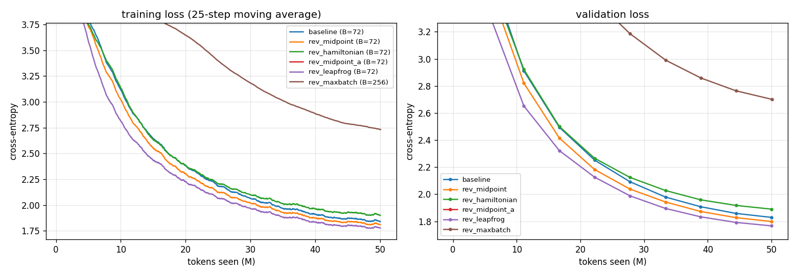
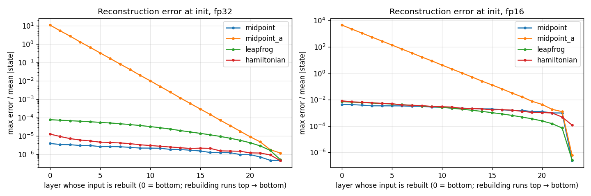
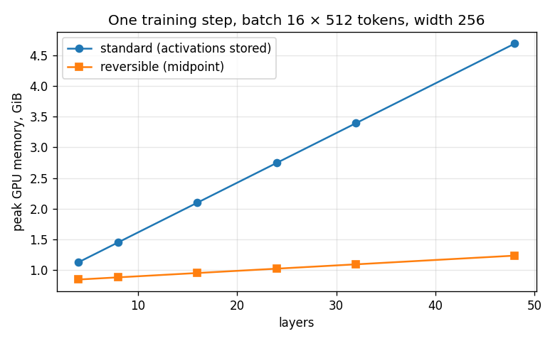
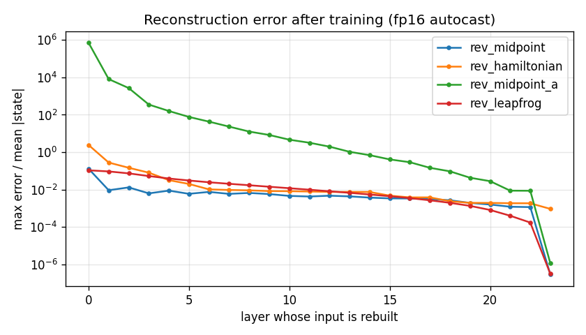
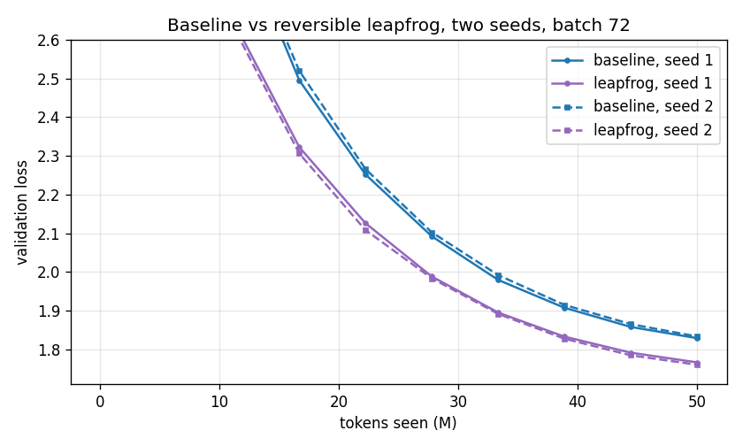

# Session 13 — Reversible transformers: training without storing activations

ERA V5, Session 13 (Distributed Training II). The assignment:

> Train a 20M LLM for 50M tokens. Fix a batch size that you can run. Train again with
> Reversibility (report which variant worked for you: mid-point, Euler, etc). Train again with
> Reversibility, but push it to the maximum batch size. Report final loss, speed (token/s),
> memory peak and other findings.

Everything below comes from one top-to-bottom run of [`S13.ipynb`](S13.ipynb) on an **NVIDIA
{{env.gpu}}** ({{env.gpu_mem_gib:.2f}} GiB usable, sm_{{env.sm}}, PyTorch {{env.torch}}), on an
AWS g4dn.2xlarge. That run wrote [`results.json`](results.json), and every number in this
README is filled in from it by [`tools/build_readme.py`](tools/build_readme.py). None is typed
by hand. The complete cell output is in [`logs/nbexec.log`](logs/nbexec.log), and the
notebook's source is [`notebook_src.py`](notebook_src.py). The whole notebook took
{{meta.total_runtime_min:.0f}} minutes, about ${{meta.total_cost_usd:.2f}} of GPU time. A second
notebook, [`S13_seeds.ipynb`](S13_seeds.ipynb) ({{seeds.runtime_min:.0f}} min), repeats the
baseline and the best reversible variant with a new seed. Its results are in `results.json`
under `seeds`.

## Results

Every run trains the same {{model.params_M:.1f}}M-parameter model on the same ~50M tokens,
seen in the same order, with the same schedule. Validation loss is measured on 524K held-out
tokens.

| run | residual rule | batch | steps | final val loss | train loss | tokens/s | peak memory (allocated / reserved) | time | cost |
| --- | --- | ---: | ---: | ---: | ---: | ---: | ---: | ---: | ---: |
| **1. baseline** | standard | {{runs.baseline.batch}} | {{runs.baseline.steps}} | **{{runs.baseline.final_val_loss:.4f}}** | {{runs.baseline.final_train_loss:.4f}} | {{runs.baseline.tokens_per_s:,.0f}} | {{runs.baseline.peak_alloc_gib:.2f}} / {{runs.baseline.peak_reserved_gib:.2f}} GiB | {{runs.baseline.wall_min:.1f}} min | ${{runs.baseline.cost_usd:.2f}} |
| 2a. reversible | midpoint | {{runs.rev_midpoint.batch}} | {{runs.rev_midpoint.steps}} | **{{runs.rev_midpoint.final_val_loss:.4f}}** | {{runs.rev_midpoint.final_train_loss:.4f}} | {{runs.rev_midpoint.tokens_per_s:,.0f}} | {{runs.rev_midpoint.peak_alloc_gib:.2f}} / {{runs.rev_midpoint.peak_reserved_gib:.2f}} GiB | {{runs.rev_midpoint.wall_min:.1f}} min | ${{runs.rev_midpoint.cost_usd:.2f}} |
| 2b. reversible | leapfrog | {{runs.rev_leapfrog.batch}} | {{runs.rev_leapfrog.steps}} | **{{runs.rev_leapfrog.final_val_loss:.4f}}** | {{runs.rev_leapfrog.final_train_loss:.4f}} | {{runs.rev_leapfrog.tokens_per_s:,.0f}} | {{runs.rev_leapfrog.peak_alloc_gib:.2f}} / {{runs.rev_leapfrog.peak_reserved_gib:.2f}} GiB | {{runs.rev_leapfrog.wall_min:.1f}} min | ${{runs.rev_leapfrog.cost_usd:.2f}} |
| 2c. reversible | hamiltonian (symplectic Euler) | {{runs.rev_hamiltonian.batch}} | {{runs.rev_hamiltonian.steps}} | **{{runs.rev_hamiltonian.final_val_loss:.4f}}** | {{runs.rev_hamiltonian.final_train_loss:.4f}} | {{runs.rev_hamiltonian.tokens_per_s:,.0f}} | {{runs.rev_hamiltonian.peak_alloc_gib:.2f}} / {{runs.rev_hamiltonian.peak_reserved_gib:.2f}} GiB | {{runs.rev_hamiltonian.wall_min:.1f}} min | ${{runs.rev_hamiltonian.cost_usd:.2f}} |
| 2d. reversible | midpoint(a), a = 0.5 | {{runs.rev_midpoint_a.batch}} | {{runs.rev_midpoint_a.steps}} | **{{runs.rev_midpoint_a.final_val_loss:.4f}}** | {{runs.rev_midpoint_a.final_train_loss:.4f}} | {{runs.rev_midpoint_a.tokens_per_s:,.0f}} | {{runs.rev_midpoint_a.peak_alloc_gib:.2f}} / {{runs.rev_midpoint_a.peak_reserved_gib:.2f}} GiB | {{runs.rev_midpoint_a.wall_min:.1f}} min | ${{runs.rev_midpoint_a.cost_usd:.2f}} |
| **3. reversible, max batch** | {{runs.rev_maxbatch.rule}} | **{{runs.rev_maxbatch.batch}}** | {{runs.rev_maxbatch.steps}} | **{{runs.rev_maxbatch.final_val_loss:.4f}}** | {{runs.rev_maxbatch.final_train_loss:.4f}} | {{runs.rev_maxbatch.tokens_per_s:,.0f}} | {{runs.rev_maxbatch.peak_alloc_gib:.2f}} / {{runs.rev_maxbatch.peak_reserved_gib:.2f}} GiB | {{runs.rev_maxbatch.wall_min:.1f}} min | ${{runs.rev_maxbatch.cost_usd:.2f}} |

Cost is wall-clock × $0.828/h, the g4dn.2xlarge on-demand Linux price in ap-south-1 from the
AWS Pricing API. Tokens/s is steady-state: every step after the first 20, with evaluation
excluded and the GPU synchronised before each clock read. Peak memory is
`torch.cuda.max_memory_allocated()` over the whole run. "Reserved" is what PyTorch's caching
allocator actually held from the card.



*Run 2d, midpoint(a), sits above the plotted range for the whole run. It finishes at
{{runs.rev_midpoint_a.final_val_loss:.2f}}. Run 3 trains on the same tokens in fewer, larger
steps.*

### The short version

1. **Memory, at the same batch.** Reversibility cut peak memory from
   {{runs.baseline.peak_alloc_gib:.2f}} GiB to {{runs.rev_midpoint.peak_alloc_gib:.2f}} GiB,
   about a third. Every reversible variant used exactly the same amount.
2. **Which variant worked.** **Leapfrog** worked best, with val loss
   {{runs.rev_leapfrog.final_val_loss:.4f}} against the baseline's
   {{runs.baseline.final_val_loss:.4f}}. A **second seed** (new initial weights and a new data
   order) repeated it: {{seeds.seed2.leapfrog.final_val_loss:.4f}} against
   {{seeds.seed2.baseline.final_val_loss:.4f}}. The gap is more than ten times the
   seed-to-seed noise; see [two seeds](#leapfrog-beats-the-baseline-and-a-second-seed-confirms-it).
   **Midpoint** also beat the baseline, in one seed, at
   {{runs.rev_midpoint.final_val_loss:.4f}}. The **symplectic-Euler (Hamiltonian)** variant
   trained normally but finished {{verdict.val_delta.rev_hamiltonian:.3f}} worse than the
   baseline. **midpoint(a) with a = 0.5**, the step size and blend coefficient the lesson
   quotes, **failed**, finishing at {{runs.rev_midpoint_a.final_val_loss:.2f}}. That failure
   was predicted from the paper's own stability analysis before any training ran; see the
   [midpoint(a) section](#why-midpointa-at-a--05-failed).
3. **Speed.** Rebuilding activations cost **+{{verdict.overhead_pct.rev_hamiltonian:.0f}}% to
   +{{verdict.overhead_pct.rev_midpoint_a:.0f}}% time per token**. That is more than the
   paper's 30–50% estimate.
4. **Max batch.** Reversibility let the batch grow from {{batch.max_standard}} to
   {{batch.max_reversible}}, {{batch.ratio:.2f}}× where the paper found about 10×, and Run 3
   used {{batch.rev_max_used}}. **It bought no speed.** Throughput at batch
   {{runs.rev_maxbatch.batch}} was {{runs.rev_maxbatch.tokens_per_s:,.0f}} tok/s, against
   {{runs.rev_leapfrog.tokens_per_s:,.0f}} at batch {{runs.rev_leapfrog.batch}}. It also cost
   loss: with the token budget fixed, {{runs.rev_maxbatch.steps}} optimizer steps instead of
   {{runs.rev_leapfrog.steps}} finished at {{runs.rev_maxbatch.final_val_loss:.2f}}.
5. **The honest bottom line for this setup.** A 21M model on a 15 GB card is not
   memory-bound. Reversibility bought memory this run did not need, and paid for it in time.
   The same 50M tokens cost ${{runs.baseline.cost_usd:.2f}} ordinarily and
   ${{runs.rev_leapfrog.cost_usd:.2f}} reversibly. This is the case the lesson itself warns
   about (§17): *"reversibility also slows a run down whenever memory is not the binding
   constraint."* The memory-vs-depth measurement below shows where it would pay.

## Setup

| | |
| --- | --- |
| model | nanoGPT-style decoder: width {{model.d}}, **{{model.L}} layers**, {{model.heads}} heads, context {{model.T}}, pre-LayerNorm, 4× GELU MLP, learned positions, tied embeddings |
| parameters | **{{model.params:,}}** ({{model.params_blocks_M:.2f}}M in the transformer blocks) |
| data | TinyStories V2 (GPT-4 split). {{data.train_tokens_available:,}} training tokens tokenized, {{data.train_budget_tokens:,}} used per run |
| tokenizer | byte-level BPE, vocabulary {{data.vocab:,}}, trained on the data ([`assets/tokenizer.json`](assets/tokenizer.json)) |
| optimizer | AdamW, β = (0.9, 0.95), **weight decay 0**, grad clip 1.0, lr 1e-3, 3% warm-up, cosine to 10% |
| regularisation | **dropout 0** |
| precision | fp16 autocast + dynamic GradScaler (the T4 has no bf16), with the **residual stream kept in fp32** |
| reversible hyper-parameters | step size h = {{model.h}}, blend a = {{model.a}}, for every rule |

**Why these choices.**
- **Deep and narrow (24 layers, width 256).** Reversibility removes memory in proportion to
  depth, so a deep model shows what it does.
- **A tokenizer trained on the data.** With GPT-2's 50K vocabulary, the embedding table alone
  would be 12.9M of the "20M" parameters.
- **TinyStories.** It is simple enough that 50M tokens teaches a 21M model real structure, so
  differences between runs show.
- **Dropout and weight decay are 0 in every run, including the baseline.** Dropout is
  incompatible with rebuilding activations, and the instructor ruled out weight decay. Keeping
  both at 0 for the baseline too means the residual rule is the *only* thing that differs.

**Fixing the batch.** "The batch size you can run" was found by trying two real training steps
at increasing batch sizes until the card ran out of memory. The standard model managed
{{batch.max_standard}}, and a 10% margin gave the fixed batch of **{{batch.fixed}}**. The same
search on the reversible model gave {{batch.max_reversible}}, and the same margin gave
**{{batch.rev_max_used}}** for Run 3. The search must run two steps, not one: Adam allocates
its state at the end of the first step, so a batch that survives one step can fail on the
second. The first version of this search did exactly that.

## How reversibility works, and the variants

An ordinary block computes `p ← p + f(p)`, where `f` is attention followed by the MLP. That
step cannot be undone: recovering `p` from `p + f(p)` needs `f(p)`, which needs `p`. So autograd
keeps every layer's input, and activation memory grows with depth.

A reversible rule carries **two** consecutive states and adds the block's output to the
*older* one, evaluating the block at the newer one. The midpoint rule (Gal et al., [*Reversing
Large Language Models for Efficient Training and
Fine-Tuning*](https://arxiv.org/abs/2512.02056), Nov 2025) is

```
p[l+1] = p[l-1] + 2h·f(p[l])        ⇒        p[l-1] = p[l+1] − 2h·f(p[l])
```

Given the top two states, you can walk back down to the bottom, so nothing in between needs to
be kept. The backward pass in [`notebook_src.py`](notebook_src.py) (`RevStack`, a custom
`torch.autograd.Function`) does exactly that. For each layer, from the top down, it:

1. rebuilds that layer's input pair with the inverse rule,
2. reruns the one layer with gradients enabled,
3. backpropagates through it.

Parameter gradients accumulate straight into `.grad`. The forward pass runs under `no_grad`
and saves only the final pair.

| rule | forward | inverse | paper |
| --- | --- | --- | --- |
| midpoint | (u, v) → (v, u + 2h·f(v)) | u = w − 2h·f(v) | eq. 2.4 |
| midpoint(a) | (u, v) → (v, a·u + (1−a)·v + h·f(v)) | u = (w − (1−a)·v − h·f(v)) / a | eq. 3.6 |
| leapfrog | (u, v) → (v, 2v − u + h²·f(v)) | u = 2v − w + h²·f(v) | eq. 2.6 |
| hamiltonian | q ← q + Attn(LN₁ p);  p ← p + MLP(LN₂ q) | p ← p − MLP(LN₂ q);  q ← q − Attn(LN₁ p) | eq. 2.8–2.9 |

**Which one is "Euler"?** The paper has no variant named Euler. It calls the Hamiltonian
scheme one "resembling the symplectic Euler integrator", and this README treats that scheme as
the Euler variant. The paper also says midpoint(a) "behaves in expectation just like the
forward Euler equation". So the Euler question is answered twice here, and the answer is
different for each.

## Before trusting any loss curve: three checks

A reversible network with a subtly wrong backward pass still trains, just worse, so a loss
curve alone proves nothing. Three gates run first, and each is an assertion that fails the
notebook if it breaks.

**Gate 1: the reversible backward computes the right gradients.** Each rule is built twice
with identical weights: once with the custom backward, once with ordinary autograd through the
same function. Every parameter's gradient is then compared, in float64, at 24 layers:

| rule | largest relative gradient difference |
| --- | ---: |
| midpoint | {{gate1.midpoint.max_rel_grad_diff:.1e}} |
| leapfrog | {{gate1.leapfrog.max_rel_grad_diff:.1e}} |
| hamiltonian | {{gate1.hamiltonian.max_rel_grad_diff:.1e}} |
| midpoint(a) | {{gate1.midpoint_a.max_rel_grad_diff:.1e}} |

Three are exact to float64 rounding. midpoint(a) is not, even in float64, and Gate 2 shows why.

**Gate 2: how accurately the stack rebuilds itself.** At initialisation, on the T4, the
rebuilt input to layer 0 is compared with the real one, as max error relative to the typical
size of the state:

| rule | fp32 | fp16 autocast (as trained) |
| --- | ---: | ---: |
| midpoint | {{gate2_init.midpoint.fp32.input:.1e}} | {{gate2_init.midpoint.fp16.input:.1e}} |
| leapfrog | {{gate2_init.leapfrog.fp32.input:.1e}} | {{gate2_init.leapfrog.fp16.input:.1e}} |
| hamiltonian | {{gate2_init.hamiltonian.fp32.input:.1e}} | {{gate2_init.hamiltonian.fp16.input:.1e}} |
| midpoint(a) | **{{gate2_init.midpoint_a.fp32.input:.1e}}** | **{{gate2_init.midpoint_a.fp16.input:.1e}}** |



**Gate 3: memory against depth.** One training step at batch 16 × 512 tokens, from 4 to 48
layers:



| layers | standard | reversible |
| ---: | ---: | ---: |
| 4 | {{depth.at_4.standard:.2f}} GiB | {{depth.at_4.midpoint:.2f}} GiB |
| 24 | {{depth.at_24.standard:.2f}} GiB | {{depth.at_24.midpoint:.2f}} GiB |
| 48 | {{depth.at_48.standard:.2f}} GiB | {{depth.at_48.midpoint:.2f}} GiB |
| **per extra layer** | **{{depth.mib_per_layer_standard:.1f}} MiB** | **{{depth.mib_per_layer_reversible:.1f}} MiB** |

This reproduces the shape of the paper's Figure 3. Two details make it more than a shape:

- **The reversible slope is the model state, not activations.** One layer's weights,
  gradients and Adam state come to {{depth.mib_per_layer_state:.1f}} MiB at 16 bytes/parameter.
  Reversibility cannot remove that, and the measured {{depth.mib_per_layer_reversible:.1f}}
  MiB is within it.
- **The difference between the slopes is the stored activations.** It is
  {{depth.act_mib_per_layer:.1f}} MiB per layer at 16 × 512 tokens × width 256, which is
  **{{depth.bytes_per_token_hidden:.1f}} bytes per token per hidden unit**. The lesson (§1,
  after Korthikanti et al. 2022) estimates **~34** for a FlashAttention transformer. The
  measurement lands within 10% of a figure derived for a different layer design.

## Findings

### Why midpoint(a) at a = 0.5 failed

This was predicted before any training ran. On the way back down, the midpoint(a) inverse
divides by *a*:

```
u = (w − (1−a)·v − h·f(v)) / a
```

At a = 0.5, whatever error `w` carries is roughly **doubled at every layer**. Over 24 layers
that is ~2²⁴ ≈ 1.7 × 10⁷ times the rounding error. The paper's own stability analysis (§3.1)
says the same thing formally: forward-and-backward stability needs |a| = 1, and the
backward-direction root of this recurrence is −1/a = −2.

What happened matches that prediction at every stage:

- **At initialisation**, the rebuilt layer-0 input was off by
  {{gate2_init.midpoint_a.fp32.input:.0f}}× the size of the state in fp32, and
  {{gate2_init.midpoint_a.fp16.input:,.0f}}× in fp16.
- **After training**, it was off by {{trained_recon.rev_midpoint_a.recon_input:.1e}}×. The
  gradient the reversible backward produced had a **cosine similarity of
  {{trained_recon.rev_midpoint_a.grad_cos:.3f}}** with the true gradient, and a relative error
  of {{trained_recon.rev_midpoint_a.grad_rel_err:.2f}}. The bottom layers were trained on
  noise.
- **The loss curve** never got below {{runs.rev_midpoint_a.final_val_loss:.2f}}, while every
  other run at the same batch finished below 1.9.

The loss still fell somewhat, presumably because the top layers' rebuilt inputs, and so their
gradients, stay accurate.

The lesson quotes h = 0.25 and a = 0.5 from Lightning LM's report, and warns that the values
must be set explicitly. I have not seen how Lightning LM defines its blend. Its 20-layer
models, a different integrator form, or a different precision regime could all change this.
What this run shows is narrower: **eq. 3.6 of the paper, at a = 0.5, 24 layers, with an
fp32 residual stream, does not reconstruct.** The Gate 1 float64 number shows the same effect
in miniature: 4e-9 where the stable rules give 1e-16.

### The stable rules drift too, after training

At initialisation, every block's output is tiny and rebuilding is accurate. After training,
the blocks do real work, and rounding in the fp16 block is amplified on the way down.

| trained model | rebuilt layer-0 input error | gradient cosine vs. true | relative gradient error |
| --- | ---: | ---: | ---: |
| midpoint | {{trained_recon.rev_midpoint.recon_input:.2f}} | {{trained_recon.rev_midpoint.grad_cos:.5f}} | {{trained_recon.rev_midpoint.grad_rel_err:.3f}} |
| leapfrog | {{trained_recon.rev_leapfrog.recon_input:.2f}} | {{trained_recon.rev_leapfrog.grad_cos:.5f}} | {{trained_recon.rev_leapfrog.grad_rel_err:.3f}} |
| hamiltonian | {{trained_recon.rev_hamiltonian.recon_input:.2f}} | {{trained_recon.rev_hamiltonian.grad_cos:.5f}} | {{trained_recon.rev_hamiltonian.grad_rel_err:.3f}} |



The mechanism is fp16. A 10⁻⁷ fp32 difference in a rebuilt input can flip an fp16 rounding
step inside the block. The block's output then differs by an fp16 unit in the last place, and
that enters the next rebuild. The gradients stay usable: cosine similarity above 0.998 for all
three stable rules. The ordering also matches the loss table. **Hamiltonian** has the largest
reconstruction error and the least accurate gradient of the three, and it is also the one
stable rule that finished behind the baseline. With one run each, that is a correlation, not a
proof. Keeping the residual stream in fp32 is what holds this to a few percent. With an fp16
stream, the drift would be much larger.

### Leapfrog beats the baseline, and a second seed confirms it

At the same batch, tokens and schedule, leapfrog finished
{{verdict.val_delta.rev_leapfrog:+.3f}} and midpoint {{verdict.val_delta.rev_midpoint:+.3f}}
in val loss relative to the baseline. With one run per arm, a gap of a few hundredths could
have been seed luck. So [`S13_seeds.ipynb`](S13_seeds.ipynb) reran the baseline and leapfrog
with a **new seed for both the initial weights and the order of the training data**, shared by
the two arms. It executes the main notebook's data, model and training-loop cells verbatim from
`notebook_src.py`, so the code is identical.

| | baseline | leapfrog | leapfrog − baseline |
| --- | ---: | ---: | ---: |
| seed 1 (init 1234, data order 1337) | {{runs.baseline.final_val_loss:.4f}} | {{runs.rev_leapfrog.final_val_loss:.4f}} | **{{seeds.seed1.delta:+.4f}}** |
| seed 2 (init 2025, data order 2026) | {{seeds.seed2.baseline.final_val_loss:.4f}} | {{seeds.seed2.leapfrog.final_val_loss:.4f}} | **{{seeds.seed2.delta:+.4f}}** |
| change from seed 1 to seed 2 | {{seeds.baseline_spread:.4f}} | {{seeds.leapfrog_spread:.4f}} | |



Changing the seed moved each arm by less than a hundredth of a nat, while the gap between the
arms is **{{seeds.mean_delta:+.3f}}** on average. Leapfrog was lower at every evaluation after
the first, in both seeds. At the first evaluation, {{curves.baseline.evals.tokens.0:,}} tokens
in, it was slightly *higher*, plausibly because its update `2v − u + h²·f(v)` scales the
block's contribution by h² = 1/16, so it starts slower. Speed and
memory repeated too: {{seeds.seed2.baseline.tokens_per_s:,.0f}} vs
{{seeds.seed2.leapfrog.tokens_per_s:,.0f}} tok/s, and {{seeds.seed2.baseline.peak_alloc_gib:.2f}}
vs {{seeds.seed2.leapfrog.peak_alloc_gib:.2f}} GiB.

This matches the paper's report that reversible models "exhibit slightly better validation
loss" (§5.1). Two seeds make the gap hard to dismiss as noise. They do not say *why* it exists,
and it is a statement about this model, data and budget, not about scale.
Midpoint's smaller gap ({{verdict.val_delta.rev_midpoint:+.3f}}) was not re-seeded. It is
larger than the seed-to-seed spread measured here, but it rests on one run.

### Rebuilding cost more than the paper's 30–50%

Time per token relative to the baseline, at the same batch of {{batch.fixed}}:

| rule | extra time per token |
| --- | ---: |
| hamiltonian | +{{verdict.overhead_pct.rev_hamiltonian:.0f}}% |
| midpoint | +{{verdict.overhead_pct.rev_midpoint:.0f}}% |
| leapfrog | +{{verdict.overhead_pct.rev_leapfrog:.0f}}% |
| midpoint(a) | +{{verdict.overhead_pct.rev_midpoint_a:.0f}}% |

The paper argues that one extra forward pass is small next to a backward pass, which costs
about twice a forward. On that arithmetic, rebuilding adds roughly a third. Here it added more
than half, for three likely reasons:

- **Each layer's backward runs separately.** It is a Python loop of small
  `torch.autograd.backward` calls, rather than one graph the engine can schedule.
- **The two-state rules add elementwise work.** Leapfrog's `2v − u` and midpoint(a)'s blend
  are fp32 elementwise passes over the whole state, per layer and per direction. That is why
  leapfrog and midpoint(a) are slowest.
- **At width 256 the matrix multiplications are small**, so fixed overheads are a larger share
  of each step.

### Maximum batch: {{batch.ratio:.1f}}×, not 10×, and why

The paper fitted about 10× the batch reversibly: an H100 went from 26 to 257. This run fitted
{{batch.max_standard}} → {{batch.max_reversible}}. The reason shows in the reversible model's
memory:

| per sequence, reversible model | |
| --- | ---: |
| the two saved boundary states | {{rev_memory_breakdown.boundary_mib_per_seq:.1f}} MiB |
| output logits for the loss (512 × 8,192: fp16 logits, fp32 upcast, fp32 gradient) | {{rev_memory_breakdown.logits_mib_per_seq:.0f}} MiB |

With the trunk's activations gone, **the output layer is what fills the card**. This is §17's
point ("reversibility does not make memory free, it moves the constraint"), showing up
somewhere the lesson did not look. At 30B parameters the constraint moves to the training
state. At 21M parameters it moves to the logits. How big the batch gain can be depends on how
much of the memory was trunk activations to begin with, and here that was 24 layers × width
256 against an 8K vocabulary. Computing the loss in chunks would remove most of the logits
term. It was left out so that the reversible model's peak shows what reversibility alone does.

### The maximum-batch run bought nothing on this card

Run 3 used batch {{runs.rev_maxbatch.batch}} at learning rate
{{verdict.lr_maxbatch:.2e}}, scaled by √(batch ratio) from 1e-3, the usual Adam rule and not a
tuned value. Two things happened:

- **No speed-up.** {{runs.rev_maxbatch.tokens_per_s:,.0f}} tok/s against
  {{runs.rev_leapfrog.tokens_per_s:,.0f}} for the same rule at batch
  {{runs.rev_leapfrog.batch}}. The T4 is already saturated at batch {{runs.rev_leapfrog.batch}},
  and going to batch {{runs.rev_maxbatch.batch}} did not change tokens/s. A bigger batch only helps throughput when the
  smaller one leaves the GPU idle. The paper's throughput gains came from
  exactly that case, a 96-layer model limited to batch 52.
- **Worse loss.** The token budget is fixed, so batch {{runs.rev_maxbatch.batch}} means
  {{runs.rev_maxbatch.steps}} optimizer steps instead of {{runs.rev_leapfrog.steps}}. At 50M
  tokens this model is still far from converged, so it needs updates more than it needs larger
  ones. It finished at {{runs.rev_maxbatch.final_val_loss:.2f}}. That comparison mixes batch
  size with step count and an untuned learning rate. It says that pushing the batch *under a
  fixed token budget* was the wrong trade here. It does not say reversible training is worse.

### When would reversibility pay?

When memory is what limits the run. The depth measurement puts a number on it: each extra
layer costs {{depth.mib_per_layer_standard:.0f}} MiB of activations ordinarily and
{{depth.mib_per_layer_reversible:.0f}} MiB reversibly, at 16 sequences. Take a model deep
enough, or sequences long enough, that the baseline is forced into a batch too small to keep
the GPU busy. Then the reversible model's larger batch buys real throughput, which more than
covers the ~60% rebuild cost. That was the paper's 96-layer result, +101% throughput. This
21M model on a 15 GB card is not that case, and the table shows it: same quality, a third of
the memory, and
+{{verdict.overhead_pct.rev_hamiltonian:.0f}}% to +{{verdict.overhead_pct.rev_leapfrog:.0f}}% more time per token for the rules that worked.

## Reproducing

```bash
pip install torch tokenizers numpy matplotlib nbformat nbclient ipykernel
python tools/py2nb.py notebook_src.py S13.ipynb     # notebook_src.py is the source of truth
python tools/run_nb.py S13.ipynb                    # ~2.3 h on a T4; fetches its own data
python tools/dump_log.py S13.ipynb logs/nbexec.log
python tools/py2nb.py notebook_seeds_src.py S13_seeds.ipynb
python tools/run_nb.py S13_seeds.ipynb              # ~40 min; must run after S13.ipynb (it extends results.json)
python tools/dump_log.py S13_seeds.ipynb logs/nbexec_seeds.log
python tools/build_readme.py                        # README.tmpl.md + results.json → README.md
```

`S13_SMOKE=1` runs the entire pipeline on a tiny model in a few minutes, on CPU or GPU. On a
CPU the memory gate is skipped.

| file | what it is |
| --- | --- |
| [`S13.ipynb`](S13.ipynb) | the executed notebook, with its T4 outputs |
| [`notebook_src.py`](notebook_src.py) | its source (`# %%` cells) |
| [`S13_seeds.ipynb`](S13_seeds.ipynb) / [`notebook_seeds_src.py`](notebook_seeds_src.py) | the second-seed check, baseline and leapfrog |
| [`results.json`](results.json) | every measured value, written by the notebook's last cell |
| [`logs/nbexec.log`](logs/nbexec.log), [`logs/nbexec_seeds.log`](logs/nbexec_seeds.log) | all cell output as plain text |
| [`logs/progress.txt`](logs/progress.txt), [`logs/progress_seeds.txt`](logs/progress_seeds.txt) | timestamped evaluation lines, written live during the runs |
| [`assets/`](assets/) | plots and the trained tokenizer |
| [`tools/`](tools/) | the build pipeline |

## References

- E. Gal, M. Eliasof, J. Turek, U. Ascher, E. Treister, E. Haber, *Reversing Large Language
  Models for Efficient Training and Fine-Tuning*,
  [arXiv:2512.02056](https://arxiv.org/abs/2512.02056) (submitted 2025-11-27). Equations 2.4,
  2.6, 2.8–2.9 and 3.6, the stability analysis in §3, and Tables 3–4.
- V. Korthikanti et al., *Reducing Activation Recomputation in Large Transformer Models*,
  [arXiv:2205.05198](https://arxiv.org/abs/2205.05198) (2022). The per-layer activation count
  behind the lesson's 34 bytes/token/hidden unit.
- R. Eldan, Y. Li, *TinyStories: How Small Can Language Models Be and Still Speak Coherent
  English?*, [arXiv:2305.07759](https://arxiv.org/abs/2305.07759) (2023). The dataset.
- The School of AI, ERA V5 Session 13, §16–17, including the lesson's account of the Lightning
  LM report (h = 0.25, a = 0.5; "dropout of zero as a correctness requirement").
