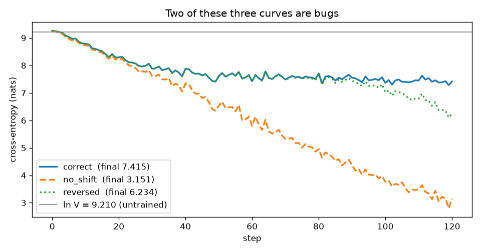
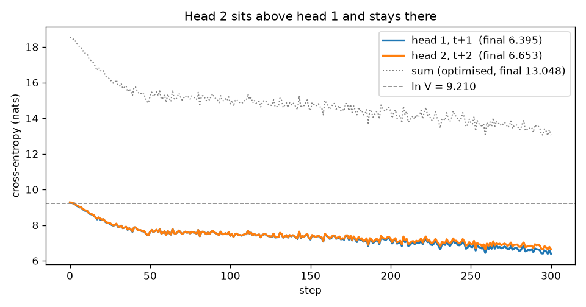

# ERA V5 · Session 9 — Loss Functions & Output Heads

A cross-entropy training harness made **correct and observable**, plus a second output head that
predicts token `t+2`.

The assignment starts from four lines:

```python
hidden = model(tokens)
logits = output_head(hidden)
loss   = cross_entropy(logits[:, :-1].reshape(-1, vocab_size), tokens[:, 1:].reshape(-1))
```

Everything here is the work of making those four lines trustworthy — because the failure mode
this session is about **raises no exception and produces a better-looking loss curve than the
correct code**.

**Notebook:** [`S9_loss_functions_and_output_heads.ipynb`](S9_loss_functions_and_output_heads.ipynb)
— runs top to bottom, committed with its outputs.
**Raw numbers:** [`results.json`](results.json), written by the notebook's final cell.
**Full run log:** [`logs/run.log`](logs/run.log).

> Every number below was read out of `results.json` by [`tools/build_readme.py`](tools/build_readme.py).
> None of them is typed by hand, so the write-up cannot drift from the run that produced it.

---

## Configuration

| | measured here (proxy) | V5 real config (analytic only) |
|---|---|---|
| vocabulary `V` | **{{config.V:,}}** | {{config.real_V:,}} |
| hidden width `D` | **{{config.D}}** | {{config.real_D:,}} |
| layers / heads | {{config.n_layer}} / {{config.n_head}} | — |
| context `T`, batch `B` | {{config.T}} / {{config.B}} | — |
| output head `[V, D]` | {{1f_tying.proxy.head:,}} params | {{1f_tying.real.head:,}} params |

Trained on CPU (`{{config.device}}`, torch {{config.torch}}), so the harness runs on a **proxy**
model and the real-configuration figures are computed analytically and labelled as such
throughout. The measurements that do not depend on scale — the shift verification, the masking
counts, the `ln V` anchor, the chunking ratio — are the same experiment at either size.

**Tokenizer: the course's own Session 2 BPE** (`V = {{config.V:,}}`, trained on en/hi/te/mr with
NFKC + Metaspace). This matters for one number in particular: **perplexity is per-token, and a
tokenizer defines the token**, so the perplexity figures below are comparable to other runs on
this vocabulary and to nothing else. The vocabulary's only special token is `[UNK]`; there is no
`[PAD]`, so padding uses `[UNK]` as filler and is masked through the *label* (`-100`), which
keeps `V` exactly {{config.V:,}} and the `ln V` anchor clean.

---

## Part 1 — the seven numbers

### 1a. Every tensor shape, and what each dimension is

| tensor | shape | what the dimensions are |
|---|---|---|
| `tokens` | `{{1a_shapes.tokens}}` | B = independent sequences · T = position |
| `hidden` | `{{1a_shapes.hidden}}` | B · T · D = residual-stream width, one vector per position |
| `head.weight` | `{{1a_shapes.head_weight}}` | V = one row per vocabulary entry · D — so `z = h · W_vocabᵀ` |
| `logits` | `{{1a_shapes.logits}}` | B · T · V = one score per vocabulary entry, per position |
| `logits[:, :-1]` | `{{1a_shapes.logits_shifted}}` | drop the last position — it has no next token to predict |
| `tokens[:, 1:]` | `{{1a_shapes.targets_shifted}}` | the answer for each prediction, shifted one step left |
| flat logits | `{{1a_shapes.flat_logits}}` | N = B·(T−1) predictions, flattened · V |
| flat targets | `{{1a_shapes.flat_targets}}` | one correct token id per prediction |

The logits tensor is **{{1a_logits_MiB:,.1f}} MiB** at this proxy size. Note what happens at the
last step: cross-entropy consumes a flat `[N, V]` against `[N]`, so the `[B, T]` structure is
gone before the scalar is computed. After `.reshape(-1, V)` there is nothing left to disagree
with — which is precisely why the next item is not optional.

### 1b. Verify the shift with token strings, not ids

The notebook prints inputs beside targets as decoded strings and asserts the contract at every
position: **target[i] == input[i+1]**, checked across all pairs in the batch.

Then it does the thing the assignment warns about — trains the same model, same seed, same data,
under three ways of lining logits up against tokens:

| variant | what it asks the model to do | loss @ {{1b_shift.steps}} steps | perplexity |
|---|---|---|---|
| **`correct`** — `logits[:, :-1]` vs `tokens[:, 1:]` | predict the **next** token | **{{1b_shift.final_loss.correct:.4f}}** | {{1b_shift.final_ppl.correct:,.1f}} |
| `no_shift` — `logits[:, :-1]` vs `tokens[:, :-1]` | predict the token at its **own** position | {{1b_shift.final_loss.no_shift:.4f}} | {{1b_shift.final_ppl.no_shift:,.1f}} |
| `reversed` — `logits[:, 1:]` vs `tokens[:, :-1]` | predict the **previous** token | {{1b_shift.final_loss.reversed:.4f}} | {{1b_shift.final_ppl.reversed:,.1f}} |



**Both bugs beat the correct objective** — `no_shift` by a factor of
{{1b_shift.ppl_ratio_no_shift:,.0f}}× on perplexity, `reversed` by
{{1b_shift.ppl_ratio_reversed:,.0f}}×. A causal model at position `i` already holds tokens
`≤ i`, so `no_shift` and `reversed` ask it to copy something it is already carrying. Nothing
raises. The curve just looks better.

The strings are what expose it. Decoding the `no_shift` model's top-1 prediction beside its input
shows it reproduces its own input **{{1b_shift.no_shift_echo_rate:.1%}}** of the time. It is a
copier, not a language model, and its loss curve never said so.

### 1c. Mask padding, and confirm the contributing-token count changes

| | count |
|---|---|
| positions in `logits[:, :-1]` | {{1c_padding.positions:,}} |
| contributing **without** masking | {{1c_padding.contributing_unmasked:,}} |
| contributing **with** masking | **{{1c_padding.contributing_masked:,}}** |
| padding positions silently trained | **{{1c_padding.pad_positions:,}}** ({{1c_padding.pad_fraction:.1%}} of the batch) |

The count is verified two ways: from the mask, and from the denominator PyTorch actually divided
by, recovered as `reduction="sum"` ÷ `reduction="mean"` = {{1c_padding.denominator_recovered:,.0f}}.

The count is the required observable. What it does to the *loss* turns out to be the more
interesting half, so three models are measured against the same padded batch:

| model | loss unmasked | loss masked | difference |
|---|---|---|---|
| untrained | {{1c_padding.untrained.loss_unmasked:.4f}} | {{1c_padding.untrained.loss_masked:.4f}} | {{1c_padding.untrained.delta:+.4f}} |
| trained on clean text (§1b) | {{1c_padding.trained_clean.loss_unmasked:.4f}} | {{1c_padding.trained_clean.loss_masked:.4f}} | {{1c_padding.trained_clean.delta:+.4f}} |
| **trained on padding, unmasked** | **{{1c_padding.trained_on_padding_unmasked.loss_unmasked:.4f}}** | **{{1c_padding.trained_on_padding_unmasked.loss_masked:.4f}}** | **{{1c_padding.trained_on_padding_unmasked.delta:+.4f}}** |

**The third row is the bug in its natural habitat.** That model reports
{{1c_padding.trained_on_padding_unmasked.loss_unmasked:.4f}} nats while its actual
language-modelling loss is {{1c_padding.trained_on_padding_unmasked.loss_masked:.4f}} — it looks
{{1c_padding.trained_on_padding_unmasked.delta:.2f}} nats better on paper than it is, because
{{1c_padding.pad_fraction:.0%}} of its exam is predicting `[UNK]` after `[UNK]`.

**The first two rows are why it is hard to catch.** Untrained, masking moves the loss by
{{1c_padding.untrained.delta:+.4f}} nats — nothing, because nothing is predictable yet, so the
mistake passes review and the first few hundred steps. And a model that never trained on padding
moves the *other* way ({{1c_padding.trained_clean.delta:+.4f}} nats): to it a pad is a rare,
out-of-distribution token rather than a freebie.

So the sign of the error is not the lesson — it depends on the model's relationship to the pad
token. The lesson is that the unmasked number is not the quantity you think it is in either
direction, and the denominator is wrong in both: {{1c_padding.positions:,}} instead of
{{1c_padding.contributing_masked:,}}.

### 1d. Pack two documents, mask the boundary

Two documents in **different languages** (English then Marathi, both from the S2 training
mixture) packed into one sequence of {{1d_packing.positions}} predicted positions. At the
boundary the model is asked to predict document B's first token from document A's last — and
nothing in document A supports it. It is not a hard example; it is a wrong one.

| model | unmasked | masked | boundary position alone | mean of other positions |
|---|---|---|---|---|
| untrained | {{1d_packing.untrained.loss_unmasked:.4f}} | {{1d_packing.untrained.loss_masked:.4f}} | {{1d_packing.untrained.boundary_token_loss:.4f}} | {{1d_packing.untrained.mean_other_positions:.4f}} |
| trained {{1b_shift.steps}} steps | {{1d_packing.trained.loss_unmasked:.4f}} | **{{1d_packing.trained.loss_masked:.4f}}** | {{1d_packing.trained.boundary_token_loss:.4f}} | {{1d_packing.trained.mean_other_positions:.4f}} |

**Explaining the difference.** In the trained model the boundary position costs
{{1d_packing.trained.boundary_excess:+.4f}} nats more than an average position — it is hard for a
reason that is an artefact of packing rather than a fact about language. Untrained, the same
position costs {{1d_packing.untrained.boundary_excess:+.4f}} nats, i.e. it is indistinguishable,
because nothing is predictable yet. But masking it moves the *reported mean* by only
{{1d_packing.trained.delta:+.4f}} nats, because it is one position out of {{1d_packing.positions}}.
That is the point worth stating: **the damage is not to this number.** It is that the gradient at that
position is real, and it teaches a cross-document transition that does not exist in the data —
once per packed document, for the whole of pre-training.

Note also the mechanism. Masking removes the position from **both** the numerator and the
denominator. Zeroing its loss instead would remove it only from the numerator and quietly bias
the mean downward — a second bug wearing the first one's clothes.

### 1e. Perplexity, and the untrained-model anchor

| | measured | predicted |
|---|---|---|
| untrained loss | **{{1e_perplexity.untrained_loss:.4f}} nats** | `ln V` = {{1e_perplexity.ln_V:.4f}} |
| untrained perplexity | **{{1e_perplexity.untrained_ppl:,.0f}}** | `V` = {{config.V:,}} |
| deviation | {{1e_perplexity.deviation_nats:+.4f}} nats | — |

Measured over {{1e_perplexity.tokens_measured:,}} tokens. An untrained model has no preferences,
spreads probability uniformly across the vocabulary, and is therefore effectively choosing
between all `V` options — so **loss ≈ ln V and perplexity ≈ V**. It lands
{{1e_perplexity.deviation_nats:+.4f}} nats off, which is the cheapest sanity check in the
session: a fresh model that does **not** sit near its vocabulary size means something upstream is
broken and every number after it is noise.

After {{1b_shift.steps}} steps of real training: **{{1e_perplexity.trained_loss:.4f}} nats,
perplexity {{1e_perplexity.trained_ppl:,.1f}}**.

At the lesson's real vocabulary the same anchor is `ln({{config.real_V:,}})` =
**{{1e_perplexity.real_config_ln_V:.4f}} nats**, perplexity {{config.real_V:,}}.

### 1f. Tied vs untied head parameters

| | this proxy | V5 real config |
|---|---|---|
| input embedding `[V, D]` | {{1f_tying.proxy.embed:,}} | {{1f_tying.real.embed:,}} |
| output head `[V, D]` | {{1f_tying.proxy.head:,}} | {{1f_tying.real.head:,}} |
| **untied** (both matrices) | **{{1f_tying.proxy.untied:,}}** | **{{1f_tying.real.untied:,}}** |
| **tied** (one matrix, used twice) | **{{1f_tying.proxy.tied:,}}** | **{{1f_tying.real.tied:,}}** |
| saved by tying | {{1f_tying.proxy.head:,}} (50.0%) | {{1f_tying.real.head:,}} (50.0%) |

Counted from the live modules, not from the formula — the notebook asserts the module's actual
`numel()` against the arithmetic.

**For V5 this is a counterfactual, not an available option.** Session 7 replaced the input
embedding table with a fixed byte codec plus one trainable projection, so there is no `[V, D]`
input table to tie to. The comparison is still worth reporting because it prices exactly what
that choice costs at the output end: at the real configuration the head alone is
**{{1f_tying.real.head:,}} parameters** — the same dense table the byte codec removed from the
input side, reappearing at the output.

### 1g. Peak memory — ordinary vs a chunked cross-entropy written by hand

The chunked implementation computes logits for a block of rows, takes that block's loss, and
throws the logits away; `torch.utils.checkpoint` makes "throws away" real by recomputing them in
backward instead of storing them. Reduction is done by hand as sum-then-divide, so a short final
chunk is not weighted like a full one.

**Correctness first**, because a memory number from a different objective means nothing:

- loss: ordinary {{1g_memory.loss_ordinary:.7f}} vs chunked {{1g_memory.loss_chunked:.7f}}
- gradient w.r.t. the head weight: max |Δ| = {{1g_memory.grad_max_delta:.2e}}

Same objective, same gradients — an implementation, not an approximation.

| | ordinary | chunked | ratio |
|---|---|---|---|
| **bytes retained for backward** | **{{1g_memory.retained_ordinary_MiB:,.2f}} MiB** | **{{1g_memory.retained_chunked_MiB:,.2f}} MiB** | **{{1g_memory.retained_ratio:.1f}}×** |
| peak process memory (RSS) | {{1g_memory.peak_rss_ordinary_MiB:,.1f}} MiB | {{1g_memory.peak_rss_chunked_MiB:,.1f}} MiB | {{1g_memory.peak_ratio:.1f}}× |

Measured over N = {{1g_memory.N_rows:,}} rows at chunk size {{1g_memory.chunk}}. Retained bytes
are counted exactly with `saved_tensors_hooks`, which sees every tensor the autograd graph
stores — deterministic and device-independent, and the quantity the lesson's GiB figures refer
to. Peak RSS is the sampled corroboration (on CUDA this line would be
`torch.cuda.max_memory_allocated()`); it is noisier and moves less because the process is already
holding the model and the interpreter.

**Why the ratio is what it is.** The ordinary path retains the full `[N, V]` softmax output. The
chunked path retains `[N, D]` plus one live block. The full `[N, V]` logits tensor alone is
{{1g_memory.full_logits_MiB:,.1f}} MiB; `V/D` = {{1g_memory.V_over_D:,.1f}}, and the measured
retention ratio is {{1g_memory.retained_ratio:.1f}}×.

**The same formula at the real configuration**, which reproduces the lesson's own figures:

| batch, context | retained for backward (bf16) |
|---|---|
| B=1, T=65,536, V={{config.real_V:,}} | {{1g_memory.real_config_GiB_at_64k:.0f}} GiB |
| B=1, T=262,144, V={{config.real_V:,}} | {{1g_memory.real_config_GiB_at_256k:.0f}} GiB |

The head's parameters are a fixed 2.1 GiB. The **logits tensor is not fixed** — it scales with
batch *and* context, which is why it, not the parameter count, decides whether a long-context
step fits in memory.

---

## Part 2 — a second head predicting `t+2`

One trunk, two output heads reading the same hidden state. Head 2's alignment is verified with
strings before training, exactly as in §1b.

| | loss (nats) | perplexity |
|---|---|---|
| **head 1** — predicts `t+1` | **{{part2.head1_loss:.4f}}** | {{part2.head1_ppl:,.2f}} |
| **head 2** — predicts `t+2` | **{{part2.head2_loss:.4f}}** | {{part2.head2_ppl:,.2f}} |
| **sum** (the quantity optimised) | **{{part2.sum:.4f}}** | — |
| gap (head 2 − head 1) | {{part2.gap:+.4f}} | — |

After {{part2.steps}} steps. At step 0: head 1 {{part2.head1_loss_step0:.4f}}, head 2
{{part2.head2_loss_step0:.4f}} — both at the `ln V` = {{1e_perplexity.ln_V:.4f}} anchor, as they
must be.



### What happens to head 2's loss, and why it is correct

Both heads start together at `ln V` and then separate. The gap grows from
**{{part2.gap_first_25:+.4f}} nats** (mean over the first 25 steps) to **{{part2.gap_last_25:+.4f}}
nats** (mean over the last 25) — head 2 falls more slowly and settles above head 1. It never
catches up, and it should not.

The reason is a property of the data, not a defect in the head. Both heads read the identical
hidden state `h_i`, summarising tokens `≤ i`. Head 1 is asked for `p(x_{i+1} | x_{≤i})`; head 2
for `p(x_{i+2} | x_{≤i})` — and `x_{i+2}` is genuinely more uncertain, because the intervening
token `x_{i+1}` is exactly the information head 2 is denied. Its target has higher conditional
entropy, and cross-entropy cannot go below the entropy of what it predicts. **The gap between the
curves is an estimate of that extra uncertainty, in nats** — and it widens as training proceeds
because early on neither head knows anything, so there is no gap to see.

Two consequences worth stating plainly:

- **A head-2 loss that matched head 1 would be evidence of a bug**, not of a better model — most
  likely a shift error that quietly handed head 2 the `t+1` target. §1b's discipline is what
  rules that out.
- **The sum is what the optimiser sees.** Head 2's gradient flows back through the shared trunk,
  pushing it to build a hidden state useful at both horizons. That is the point of multi-token
  prediction: more supervision per forward pass, and a spare head that can *propose* the
  next-but-one token at inference — speculative decoding where the draft model is the model.

---

## Honest limits

- **The proxy is a proxy.** `V = {{config.V:,}}`, `D = {{config.D}}` on CPU. Every scale-dependent
  figure for the real V5 configuration is computed analytically and labelled; none is presented as
  measured. The scale-independent results (shift verification, mask counts, `ln V` anchor,
  chunking ratio and its `D/V` explanation) are the same experiment at either size.
- **Training runs are short** ({{1b_shift.steps}} and {{part2.steps}} steps). They are long enough
  to establish the qualitative facts claimed here — the shift bug beats the correct objective, the
  `t+2` gap opens and widens — and not long enough for the absolute loss values to mean anything as
  language-modelling quality.
- **Perplexity is not comparable across tokenizers.** These numbers belong to the S2 BPE
  vocabulary.
- **Peak RSS is a sampled measurement** and the noisier of the two memory numbers; the retained-
  bytes figure is the exact one.

## Files

| path | what it is |
|---|---|
| `S9_loss_functions_and_output_heads.ipynb` | the notebook, with outputs, runs top to bottom |
| `results.json` | every graded number, written by the notebook's last cell |
| `logs/run.log` | full stdout of the run |
| `notebook_src.py` | the notebook's source, in `# %%` cell form |
| `tools/py2nb.py`, `tools/run_nb.py`, `tools/build_readme.py` | build the notebook, execute it, render this README |
| `assets/tokenizer.json` | the Session 2 BPE tokenizer |
| `assets/corpus_en.txt`, `assets/corpus_mr.txt` | training text, from the S2 corpus |

## Reproducing

```bash
pip install torch tokenizers matplotlib nbformat nbclient ipykernel
python tools/py2nb.py notebook_src.py S9_loss_functions_and_output_heads.ipynb
python tools/run_nb.py S9_loss_functions_and_output_heads.ipynb   # writes results.json
python tools/build_readme.py                                      # renders this file
```

The notebook also runs unmodified on Colab — its first cell installs what it needs and pulls the
tokenizer and corpora from this repo.
